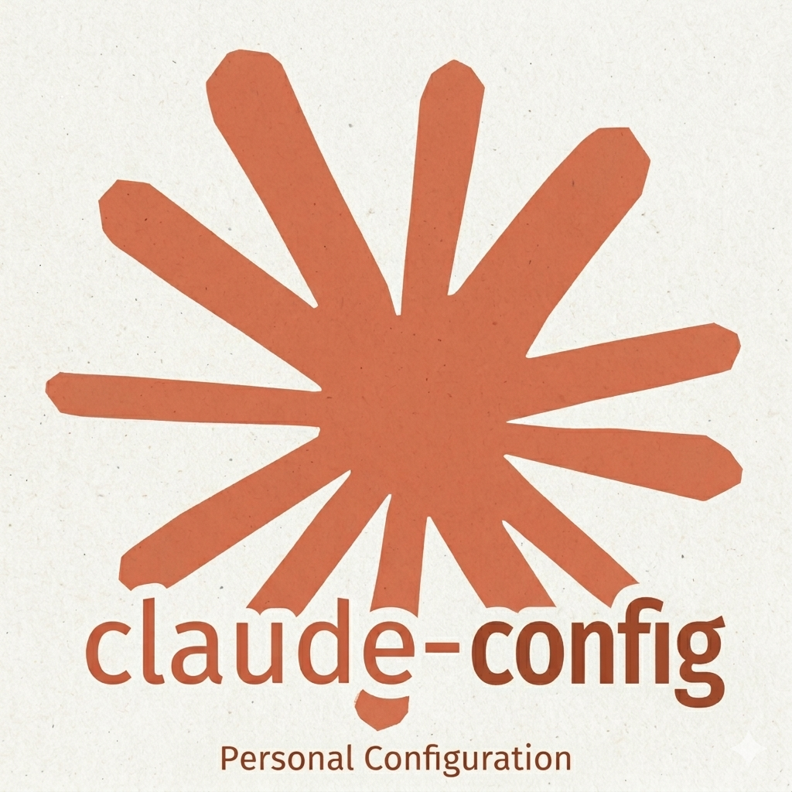

<div align="center">

<p align="center">
    
</p>

# claude-config

⚙️ Personal [Claude Code] configuration and tooling.

</div>

## ⚡ Quick Start

```
# Install Claude configuration
# mv ~/.claude ~/.claude.bak  # backup existing config if needed
git clone https://github.com/TheoBrigitte/claude-config.git
ln -srvT claude-config/.claude ~/.claude

# Install claudy
cd claude-config/claudy
go install -v

# Set environment variables
export CLAUDE_CONFIG_MCP_DIR=/path/to/claude-config/mcp-servers                # required to use claudy
export CLAUDE_CONFIG_SANDBOX_CMD=/path/to/claude-config/bin/claude-sandbox.sh  # required to use sandbox mode
export CLAUDE_CONFIG_SANDBOX_DIR=/path/to/sandbox-data                         # persistent sandbox data directory
export CLAUDE_CONFIG_ICON_PATH=/path/to/icon.png                               # optional, for notifications
```


## 🧰 [mcp-servers/](mcp-servers/)

MCP server configurations (JSON), one per server:

`context7` `github` `jina` `kubernetes` `muster` `pagerduty` `playwright` `prometheus` `sequential-thinking` `slack` `time`

## 🚀 [claudy/](claudy/)

CLI wrapper around `claude` that manages MCP server configurations. Written in Go.

```
claudy --mcp-list                        # list available MCP servers
claudy --mcp-servers github,slack        # launch claude with specific MCP servers
claudy --mcp-servers github -- --resume  # pass extra flags to claude
```

Claudy reads JSON config files from [mcp-servers/](mcp-servers/) and passes them to `claude --mcp-config`. It also handles a Grafana MCP hook that sets up kubectl port-forwarding and Grafana service account tokens automatically.

## ⚙️ [.claude/](.claude/)

This is the standard configuration directory for Claude, it contains:

- **agents/golang-pr-reviewer.md** -- Custom agent for reviewing Go pull requests.
- **skills/investigate-incident/** -- Skill to investigate Kubernetes incidents using PagerDuty, kubectl, and Grafana.
- **skills/generate-llms-txt/** -- Skill to generate `llms.txt` files for websites.
- **settings.json** -- Permissions, hooks, and plugin config.

It requires configuration via environment variables:

- `CLAUDE_CONFIG_MCP_DIR`: absolute path to the `mcp-servers/` directory containing MCP server JSON configs.
- `CLAUDE_CONFIG_SANDBOX_CMD`: command to launch the sandbox environment, e.g. `/path/to/bin/claude-sandbox.sh`)

## 🔔 Notifications

Desktop notification support is configured using `notify-send`. Claude uses this to send notifications for permission requests or when it needs the user attention.

This is configured via hooks in the [.claude/settings.json](.claude/settings.json) file and the [.claude/hooks/notify.sh](.claude/hooks/notify.sh) notification script.

An optional icon path can be specified via the `CLAUDE_CONFIG_ICON_PATH` environment variable.

<video width="630" height="300" src="https://github.com/user-attachments/assets/5bb36996-7937-49b0-a7b4-b270ba7f2423.mp4"></video>

## 🔒 Sandboxing

Sandboxing is supported via the [bin/claude-sandbox.sh](bin/claude-sandbox.sh) [bubblewrap] startup script, this creates an isolated user namespace to run Claude with limited system access for better security. This can be run using `claudy --sandbox` which will launch Claude inside the sandbox environment.

## 📦 Dependencies

- [Claude Code] -- `claude` CLI
- [claude-statusline] -- Display Claude status information in the terminal.
- [bubblewrap] -- For sandboxing Claude with limited system access.
- [Go] 1.25 -- to build claudy

[Claude Code]: https://docs.anthropic.com/en/docs/claude-code
[claude-statusline]: https://github.com/TheoBrigitte/claude-statusline
[bubblewrap]: https://github.com/containers/bubblewrap
[Go]: https://go.dev/
